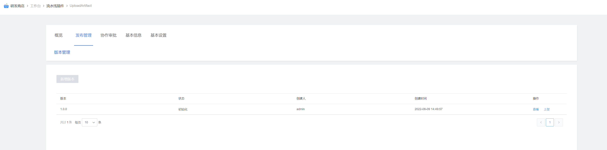
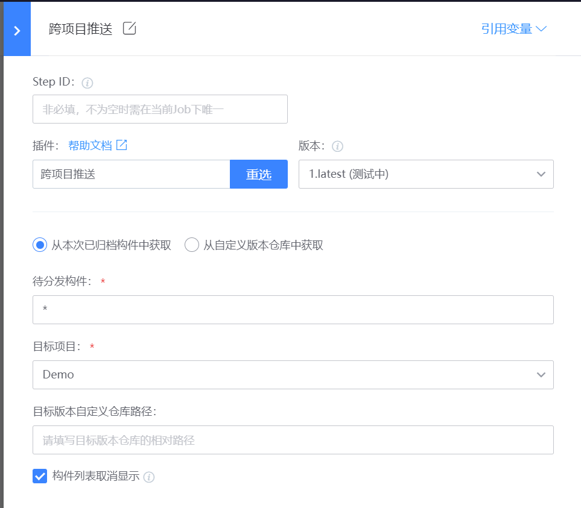

# 插件功能
跨项目上传构件至其他项目自定义仓库

# 适用场景
将当前项目归档的构件或当前项目的自定义仓库的文件跨项目推送到其他项目的自定义仓库

# 使用指南
## 一、新增插件
在蓝盾的研发商店->工作台->新增插件 页面

各字段值填写如下:

名称: 跨项目推送构件（这个可以自定义)

标识: AcrossProjectDistribution

调试项目: 选择自己的项目

开发语言: java

自定义前端: 否

### 二、发布管理
新增插件后，就会跳转到插件发布管理界面,点击"上架”

### 三、上架插件
步骤:

1.上传插件图标,插件图标可以直接使用[AcrossProjectDistribution](images/logo.png)

2.插件job类型,linux、macos、windows都选上

3.上传插件包，插件包从[releases](https://github.com/TencentBlueKing/ci-AcrossProjectDistribution/releases)下载最新版本插件zip包

4.填写发布日志

# 参数说明

如上图所示：

1. 待分发构件可以是本次归档的构件也可以是自定义仓库的构件（相对路径支持*通配符）
2. 目标项目选择想要上传的项目
3. 自定义仓库的仓库路径：
    - 可不填,默认会在目标项目自定义仓库下
4. 构件列表取消显示: 分发本次已归档构件到当前项目自定义仓库时，勾选此项后流水线构件列表中不会显示分发的构件。避免重复显示 