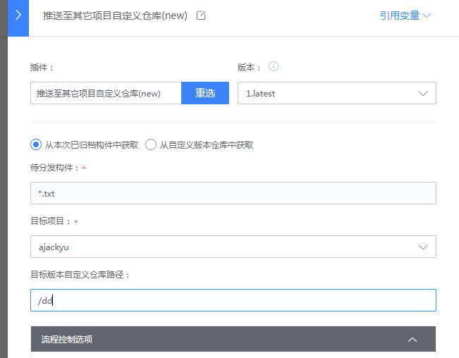

# 插件功能
跨项目上传构件至其他项目自定义仓库

# 适用场景
将当前项目归档的构件或当前项目的自定义仓库的文件跨项目推送到其他项目的自定义仓库

# 参数说明

如上图所示：

1. 待分发构件可以是本次归档的构件也可以是自定义仓库的构件（相对路径支持*通配符）
2. 目标项目选择想要上传的项目
3. 自定义仓库的仓库路径：
    - 可不填,默认会在目标项目自定义仓库下

# 编译配置
0. gradle 4.8 ~ 4.10
1. 生成一个token在[account settings page](https://github.com/settings/tokens)
2. 修改gradle.properties文件中的MAVEN_CRED_USERNAME、MAVEN_CRED_PASSWORD和MAVEN_REPO_URL
或者在gradle命令运行时增加-DmavenCredUserName、-DmavenCredPassword和-DmavenRepoUrl
- mavenCredUserName：github用户名
- mavenCredPassword：第一步生成的token 
- mavenRepoUrl: maven仓库地址